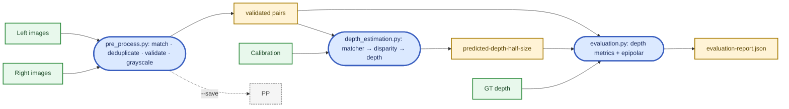
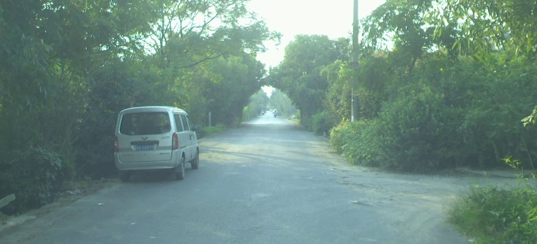
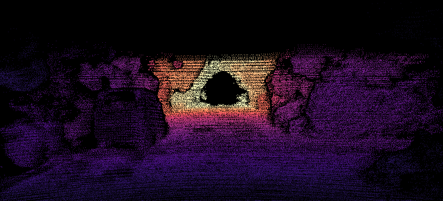
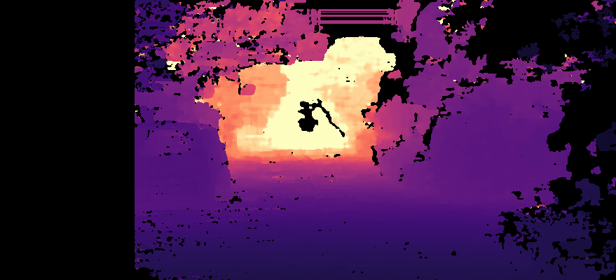

# KITTI Stereo Depth Estimation

Concise, modular toolkit that computes depth maps for the KITTI-style stereo data
under `Data/` and evaluates them against the provided ground truth.

```
Data/
├── left-image-half-size/  left-image-half-size/   *.jpg   (879x400, rectified)
├── right-image-half-size/ right-image-half-size/  *.jpg
├── half-image-calib/      half-image-calib/       <session>.txt
└── depth-map-half-size/   depth-map-half-size/    <session>/*.png   (uint16, depth_m = px/256)
```

## Install

```bash
pip install -r requirements.txt
```

## Modules

Each file can be run on its own *or* imported from `pipeline.py`. Every stage
supports `--parallel` (process pool over pairs) and `--workers N`.

| File | Purpose |
|---|---|
| `pre_process.py`     | Match timestamps, dedupe, validate pairs. `--save` to also write grayscale copies. |
| `depth_estimation.py`| Disparity → depth using `P_rect_101` (intrinsics) and `|T_103[0]|` (baseline). Stereo matchers live in a name-keyed registry; current entries: **`sgbm`** (default) and **`bm`**. Writes 16-bit PNGs in KITTI format. |
| `evaluation.py`      | Standard depth metrics (AbsRel, SqRel, RMSE, RMSE-log, log10, δ<1.25^k) plus epipolar-rectification quality from ORB matches (mean / median \|Δy\|, inlier fractions, Sampson residual). |
| `pipeline.py`        | Orchestrator. Selects stages and chooses sequential vs parallel execution. |

### Pipeline flow



`pipeline.py` is the orchestrator that calls the three stages in order; `--stages` lets you run any subset and `--mode {sequential,parallel}` controls how each stage iterates over pairs. Each stage is also runnable directly (`python pre_process.py`, `python depth_estimation.py`, `python evaluation.py`).

## Quick start (end-to-end)

```bash
python pipeline.py --mode parallel                       # all stages, parallel within each
python pipeline.py --mode sequential --limit 50          # debug on first 50 pairs
python pipeline.py --stages depth,eval --mode parallel   # skip preprocessing
python pipeline.py --stages pre --save-preproc           # only preprocess + persist
python pipeline.py --algorithm bm --mode parallel        # swap in a different stereo matcher
```

## Stand-alone usage

```bash
python pre_process.py        --parallel --save           # validate + write grayscale pairs
python depth_estimation.py   --parallel                  # write predicted depths
python evaluation.py         --parallel                  # write Data/evaluation-report.json
```

## Outputs

* `Data/predicted-depth-half-size/<session>/<stem>.png` — predicted depth, uint16, `depth_m = pixel / 256`.
* `Data/pre-processed-images/{left,right}/*.jpg` — only created with `--save` / `--save-preproc`.
* `Data/evaluation-report.json` — aggregate metrics, per-pair scores, and stage timings.

### Sample

| Left RGB | Ground-truth depth | Predicted depth |
|:---:|:---:|:---:|
|  |  |  |

## Notes on calibration

The supplied `P_rect_103[0,3]/P_rect_103[0,0]` is **twice** the physical baseline
(verified against the GT depth: pred/gt median ratio collapses from 2.0 to 1.0
when `|T_103[0]| = 0.5449 m` is used). `stereo_geometry()` therefore prefers
`T_103` and falls back to the projection matrix only when `T_103` is absent.

## Stereo matching algorithms

Algorithms live in a name-keyed registry in `depth_estimation.py`. Each entry is a
function with signature

```python
fn(left_gray: np.ndarray, right_gray: np.ndarray, **kwargs) -> np.ndarray
# returns float32 disparity in pixels; invalid pixels = NaN
```

| Name   | Backend             | Notes |
|--------|---------------------|-------|
| `sgbm` | `cv2.StereoSGBM`    | Default. Best quality / speed trade-off for KITTI-scale rectified imagery. |
| `bm`   | `cv2.StereoBM`      | Classic block matching. Faster but sparser and noisier than SGBM. |

Select one via `--algorithm <name>` on either `depth_estimation.py` or `pipeline.py`.

### Adding a new algorithm

Register it with the `@register_algorithm` decorator anywhere that imports the
module — it will immediately become a valid `--algorithm` choice.

```python
from depth_estimation import register_algorithm
import cv2, numpy as np

@register_algorithm("my_matcher")
def my_matcher(left, right, num_disparities=192, block_size=5, **_):
    # ... compute disparity however you like (classical, learned, etc.) ...
    # return float32 disparity in pixels with NaN for invalid pixels
    return disparity
```

The dispatcher `compute_disparity(left, right, algorithm=...)` and the per-pair
worker pick it up automatically; no other code needs to change.

## CLI arguments

`●` = argument is accepted by that script. Defaults below are written relative to
`Data/` for brevity; common aliases (`--left-dir`, `--right-dir`, `--workers`,
`--parallel`) appear in every stand-alone script.

| Argument            | Type / Default                                  | pre | depth | eval | pipe | Description |
|---------------------|-------------------------------------------------|:---:|:-----:|:----:|:----:|-------------|
| `--left-dir`        | Path / `left-image-half-size/left-image-half-size`  | ● | ● | ● | ● | Folder of left RGB frames. |
| `--right-dir`       | Path / `right-image-half-size/right-image-half-size`| ● | ● | ● | ● | Folder of right RGB frames. |
| `--calib-dir`       | Path / `half-image-calib/half-image-calib`      |     | ● |     | ● | Folder of `<session>.txt` calibration files. |
| `--gt-dir`          | Path / `depth-map-half-size/depth-map-half-size`|     |   | ● | ● | Ground-truth depth root (uint16 PNG, KITTI scale). |
| `--pred-dir`        | Path / `predicted-depth-half-size`              |     |   | ● | ● | Where predicted depth PNGs are read from (eval). |
| `--output-dir`      | Path / `pre-processed-images` (pre) or `predicted-depth-half-size` (depth) | ● | ● |     |   | Output folder for the stand-alone script. |
| `--preproc-dir`     | Path / `pre-processed-images`                   |     |   |     | ● | Output folder for pre-processed pairs (pipeline). |
| `--report`          | Path / `evaluation-report.json`                 |     |   | ● | ● | Where the JSON report is written. |
| `--save`            | flag (default off)                              | ● |   |     |   | Persist validated grayscale pairs to disk. |
| `--save-preproc`    | flag (default off)                              |     |   |     | ● | Pipeline equivalent of `--save` for the `pre` stage. |
| `--color`           | flag (default off)                              | ● |   |     |   | When saving, keep BGR instead of grayscale. |
| `--algorithm`       | str / `sgbm` (choices: `sgbm`, `bm`)            |     | ● |     | ● | Stereo matcher to dispatch to (see *Stereo matching algorithms*). |
| `--num-disparities` | int / `192`                                     |     | ● |     | ● | Disparity search range; must be a multiple of 16. |
| `--block-size`      | int / `5`                                       |     | ● |     | ● | Matching window size (odd, ≥ 3 for SGBM; BM forces odd). |
| `--no-epipolar`     | flag (default off)                              |     |   | ● | ● | Skip ORB-based rectification metrics (faster). |
| `--parallel`        | flag (default off)                              | ● | ● | ● |   | Use a process pool over pairs. |
| `--mode`            | `sequential` \| `parallel` / `sequential`       |     |   |     | ● | Pipeline equivalent of `--parallel`. |
| `--workers`         | int / `None` (= os default)                     | ● | ● | ● | ● | Worker count for the process pool. |
| `--stages`          | str / `all`                                     |     |   |     | ● | Comma list from `{pre,depth,eval}` or `all`. |
| `--limit`           | int / `None`                                    |     | ● | ● | ● | Process only the first N validated pairs (debug). |

## Evaluation report (`evaluation-report.json`)

Top-level keys depend on which entry-point wrote the file:

| Key         | Type   | Written by             | Description |
|-------------|--------|------------------------|-------------|
| `aggregate` | object | `evaluation`, `pipeline` | Dataset-wide metrics (see next table). |
| `per_pair`  | array  | `evaluation`, `pipeline` | One object per evaluated pair. |
| `timings`   | object | `pipeline` only        | Wall-clock seconds per stage: `pre`, `depth`, `eval`. |
| `config`    | object | `pipeline` only        | Snapshot of the CLI arguments (all values stringified). |

### `aggregate` and `per_pair[*]` fields

Depth metrics are weighted by the per-image valid-pixel count when aggregated.
Epipolar metrics are simple means across pairs that returned ≥ 8 matches.


| Field              | Where           | Units / Range       | Lower / Higher better | Meaning |
|--------------------|-----------------|---------------------|-----------------------|---------|
| `abs_rel`          | both            | unitless, ≥ 0       | lower                 | Absolute Relative Error: mean of `\|pred − gt\| / gt`. |
| `sq_rel`           | both            | metres (or unitless)| lower                 | Squared Relative Error: mean of `(pred − gt)² / gt`. |
| `rmse`             | both            | metres, ≥ 0         | lower                 | Root Mean Squared Error: `√mean((pred − gt)²)`. |
| `rmse_log`         | both            | log-metres, ≥ 0     | lower                 | Logarithmic RMSE: `√mean((log pred − log gt)²)`. |
| `log10`            | both            | log-metres, ≥ 0     | lower                 | Mean Absolute Log10 Error: `mean \|log₁₀ pred − log₁₀ gt\|`. |
| `d1`               | both            | [0, 1]              | higher                | Accuracy threshold ($\delta < 1.25$): fraction of pixels where `max(pred/gt, gt/pred) < 1.25`. |
| `d2`               | both            | [0, 1]              | higher                | Accuracy threshold ($\delta < 1.25²$): fraction of pixels where `max(pred/gt, gt/pred) < 1.5625`. |
| `d3`               | both            | [0, 1]              | higher                | Accuracy threshold ($\delta < 1.25³$): fraction of pixels where `max(pred/gt, gt/pred) < 1.9531`. |
| `epi_mean_dy`      | both            | pixels, ≥ 0         | lower                 | Epipolar Error: mean vertical offset `\|y_L − y_R\|` of matching ORB features across the stereo pair. |
| `epi_median_dy`    | both            | pixels, ≥ 0         | lower                 | Median vertical offset; robust to false feature matches. |
| `epi_p1`           | both            | [0, 1]              | higher                | Percentage of matches with strict vertical alignment error `\|Δy\| < 1 px`. |
| `epi_p2`           | both            | [0, 1]              | higher                | Percentage of matches with vertical alignment error `\|Δy\| < 2 px`. |
| `epi_p3`           | both            | [0, 1]              | higher                | Percentage of matches with vertical alignment error `\|Δy\| < 3 px`. |
| `epi_sampson_rect` | both            | pixels, ≥ 0         | lower                 | Root Mean Square (RMS) of Sampson distance residuals relative to the ideal rectified fundamental matrix. |
| `n_valid`          | `per_pair` only | count (int)         | —                     | Number of valid ground-truth depth pixels used for evaluation in this specific image pair. |
| `epi_n_matches`    | `per_pair` only | count (int)         | —                     | Number of unique Lowe's ratio-filtered ORB feature matches used to calculate epipolar metrics. |
| `name`             | `per_pair` only | string              | —                     | Target filename of the left RGB image frame. |
| `n_pairs`          | `aggregate` only| count (int)         | —                     | Total number of stereo image pairs successfully evaluated in the dataset split. |
| `total_valid`      | `aggregate` only| count (int)         | —                     | Accumulated sum of valid depth pixels evaluated across the entire sequence. |

